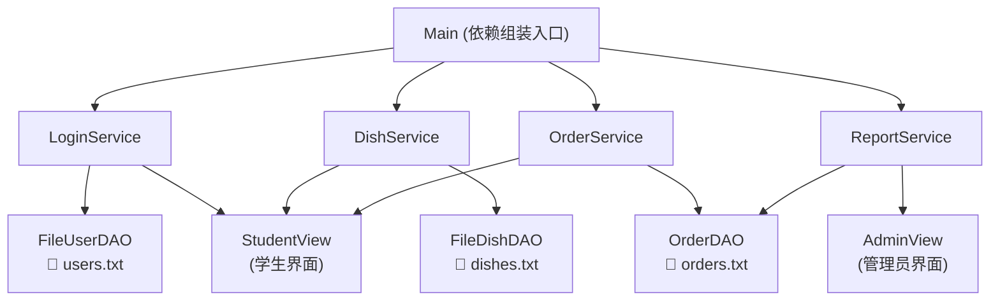

以下是**完整修正版 README.md**，可以直接复制粘贴到你的 GitHub 仓库：

```markdown
# 校园食堂订餐系统

> 基于 Java 11 + 文件存储的控制台订餐系统  
> 支持学生订餐、管理员统计、数据持久化，并提供完整的单元测试与 CI 集成。

---

## 📐 系统架构图（模块关系）



**说明**：
- **数据层**：使用文件存储（`data/` 目录），无需安装数据库。
- **服务层**：通过构造方法注入 DAO，便于测试和替换实现。
- **视图层**：控制台交互，区分学生和管理员界面。

---

## 🚀 本地开发环境搭建步骤

### 前置条件

| 工具 | 版本要求 | 安装验证命令 |
|------|----------|--------------|
| JDK   | 11+      | `java -version` |
| Maven | 3.6+     | `mvn -version`  |
| Git   | 任意     | `git --version` |

### 克隆与运行

```bash
# 1. 克隆仓库
git clone https://github.com/kaixinmeiyitian520112/canteen-system.git
cd canteen-system

# 2. 编译项目
mvn clean compile

# 3. 运行测试（验证环境）
mvn test

# 4. 启动应用
mvn exec:java -Dexec.mainClass="com.example.canteen.Main"
```

### 首次运行说明

- 系统会在项目根目录自动创建 `data/` 文件夹。
- 若 `data/dishes.txt` 不存在，自动生成 5 个默认菜品。
- 若 `data/users.txt` 不存在，自动生成测试账号：

| 角色   | 账号     | 密码     | 姓名   |
|--------|----------|----------|--------|
| 学生   | stu1     | 123456   | 张三   |
| 学生   | stu2     | 123456   | 李四   |
| 学生   | stu3     | 123456   | 王五   |
| 管理员 | admin    | 123456   | 管理员 |

### 验证成功

启动后看到以下菜单即表示成功：

```
╔════════════════════════════════════════╗
║   校园食堂「光盘」行动智能推荐系统           ║
║        Sprint 2 - 重构版本              ║
╚════════════════════════════════════════╝

--- 主菜单 ---
  1. 用户登录
  2. 查看测试账号
  3. 退出系统
```

---

## 📦 核心业务模块职责说明

| 模块路径 | 职责 | 关键方法 |
|----------|------|----------|
| `entity/User.java` | 用户实体 | `getUsername()`, `getPassword()`, `getRole()` |
| `entity/Dish.java` | 菜品实体 | `getId()`, `getName()`, `getPrice()` |
| `entity/Order.java` | 订单实体 | `getOrderId()`, `getPrice()`, `getPortion()` |
| `dao/UserDAO.java` | 用户数据接口 | `findByUsername()`, `save()`, `delete()` |
| `dao/DishDAO.java` | 菜品数据接口 | `findById()`, `findAll()`, `save()`, `delete()` |
| `dao/OrderDAO.java` | 订单数据操作 | `readAllOrders()`, `saveOrder()`, `generateOrderId()` |
| `dao/impl/FileUserDAO.java` | 用户文件存储实现 | 读写 `users.txt` |
| `dao/impl/FileDishDAO.java` | 菜品文件存储实现 | 读写 `dishes.txt` |
| `service/LoginService.java` | 登录认证 | `login()`, `getTestAccounts()` |
| `service/DishService.java` | 菜品管理 | `getAllDishes()`, `printDishes()` |
| `service/OrderService.java` | 订单创建与提交 | `createOrder()`, `submitOrder()` |
| `service/ReportService.java` | 统计报表 | `getStatistics()`, `printReport()` |
| `view/StudentView.java` | 学生端界面 | `run()`, `showOrderMenu()` |
| `view/AdminView.java` | 管理员端界面 | `run()` |
| `Main.java` | 应用入口 & 依赖组装 | `main()`, `handleLogin()` |
| `mock/ApiMockTest.java` | API 契约测试 | 模拟前后端分离场景 |
| `.github/workflows/ci.yml` | CI 流水线 | 自动编译 + 测试 |

---

## 🧪 运行单元测试

本项目使用 **JUnit 5** + **Mockito** 进行单元测试，测试覆盖登录、订单、报表三个核心服务。

```bash
# 运行所有测试
mvn test

# 运行单个测试类
mvn test -Dtest=LoginServiceTest
mvn test -Dtest=OrderServiceTest
mvn test -Dtest=ReportServiceTest
```

**测试用例列表**：

| 测试类 | 测试场景 |
|--------|----------|
| `LoginServiceTest` | 登录成功、密码错误、用户不存在 |
| `OrderServiceTest` | 整份/半份价格计算、订单提交 |
| `ReportServiceTest` | 多订单统计（去重人数、份量累加）、空数据、打印不抛异常 |

---

## 📁 数据文件说明

所有数据存储在项目根目录的 `data/` 文件夹下：

| 文件名 | 格式 | 说明 |
|--------|------|------|
| `users.txt` | CSV（账号,密码,角色,姓名） | 用户数据，首次启动自动生成测试账号 |
| `dishes.txt` | CSV（ID,名称,价格,描述） | 菜品数据，首次启动自动生成 5 个默认菜品 |
| `orders.txt` | CSV（订单ID,账号,姓名,菜品ID,菜品名,份量,价格,日期） | 订单记录，每次订餐追加 |

---

## 👥 新成员上手引导

1. **环境准备**：按“本地开发环境搭建步骤”安装 JDK + Maven + Git。
2. **克隆并运行**：执行 `mvn test` 验证环境，执行 `Main` 启动应用。
3. **理解代码**：
   - 从 `Main.java` 入口阅读，理解依赖注入组装方式。
   - 如需修改数据存储格式，重点关注 `dao/impl/` 下的文件读写逻辑。
   - 如需新增功能，遵循：`entity` → `dao` → `service` → `view` → `Main` 组装。
4. **提交代码前**：运行 `mvn test` 确保所有测试通过。

---

## 📄 许可证

本项目仅供课程学习使用。

---

## 🤝 团队

- 樊世奇（学号：9107123050）- Product Owner (PO)
- 李晨希（学号：9109223109）- Scrum Master (SM)
- 郑茹怡（学号：9109223175）- Development Team
```

---

